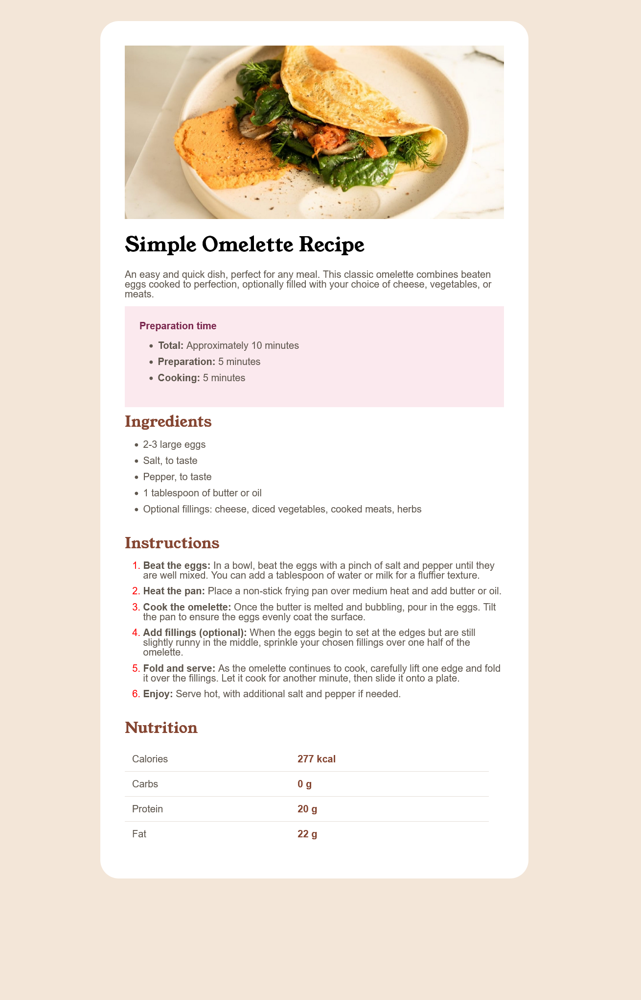

# Frontend Mentor - Recipe page solution

This is a solution to the [Recipe page challenge on Frontend Mentor](https://www.frontendmentor.io/challenges/recipe-page-KiTsR8QQKm). Frontend Mentor challenges help you improve your coding skills by building realistic projects. 

## Table of contents

- [Frontend Mentor - Recipe page solution](#frontend-mentor---recipe-page-solution)
  - [Table of contents](#table-of-contents)
  - [Overview](#overview)
    - [Screenshot](#screenshot)
      - [Phone view](#phone-view)
      - [Laptop view](#laptop-view)
    - [Links](#links)
  - [My process](#my-process)
    - [Built with](#built-with)
    - [What I learned](#what-i-learned)
    - [Continued development](#continued-development)
    - [Useful resources](#useful-resources)
  - [Author](#author)


## Overview
The intention of the practice was to learn about some things like 
- How to manage a list 
- How to create a responsive website
- How to style a table
- Hw to deal with different fonts in a same page
- How to deal with tables
### Screenshot
#### Phone view

#### Laptop view


### Links

- Solution URL: [https://github.com/EkoNdongAyecaba/recipes-front-end-mentor](https://github.com/EkoNdongAyecaba/recipes-front-end-mentor)
- Live Site URL: [https://ekondongayecaba.github.io/recipes-front-end-mentor]( https://ekondongayecaba.github.io/recipes-front-end-mentor)

## My process
The first thing i did when i begun with the project was to module properly the html file, adding the correct tags in the correct positions.
After it i begun to add styles with SASS, creating some components and adding them to the page 
### Built with

- Semantic HTML5 markup
- CSS custom properties
- Flexbox
- CSS Grid
- Mobile-first workflow

### What I learned

- how to customize the numbers of a list
 ```scss
.ol{
    @include list();
    list-style-type: decimal;
    li::marker{
        color: red;
    }
}
```
- How to use and style tables
```html
<table class="text-p">
          <tr class="fil">
            <td class="p-1">Calories</td>
            <td class="td pl-4 pr-4">277 kcal</td>
          </tr>
          <tr class="fil">
            <td class="p-1">Carbs</td>
            <td class="td pl-4">0 g</td>
          </tr>
          <tr class="fil">
            <td class="p-1">Protein</td>
            <td class="td pl-4">20 g</td>
          </tr>
          <tr>
            <td class="p-1">Fat</td>
            <td class="td pl-4">22 g</td>
          </tr>
        </table>
```
```css
.tab__container{

    width: 100%;
}

.tab{
    table-layout: fixed;

}

.fil{
    border-bottom: 1px solid hsl(30, 18%, 87%);
}

.td{
    color: $primary;
    font-weight: 700;
}

```

### Continued development

I will continue to increase the library, adding new colors, mixin and components
[This is the repository where i will put the library](https://github.com/EkoNdongAyecaba/shinobi-library)
### Useful resources

- [Mozilla](https://developer.mozilla.org/en-US/docs/Web/HTML/) - This helped me dealing with the table, and also given some details of lists. I really liked this pattern and will use it going forward.
- [Ninja Library](https://www.youtube.com/watch?v=_kqN4hl9bGc&list=PL4cUxeGkcC9jxJX7vojNVK-o8ubDZEcNb&index=1&ab_channel=NetNinja) - This is an amazing article which helped me fto understand really how Bootstrap, Tailwind or others frameworks work teaching me how i can buy my own library. I'd recommend it to anyone still learning this concept.
- [DaniCodex](https://www.youtube.com/watch?v=xf6bH1K92ms&ab_channel=DaniCodex) - This is an amazing article which say how to deal with list numbers

## Author


- Frontend Mentor - [@EkoNdongAyecaba](https://www.frontendmentor.io/profile/EkoNdongAyecaba)
- Twitter - [@EkoNdongAyecaba](https://www.twitter.com/Shiitake_EGBM)
